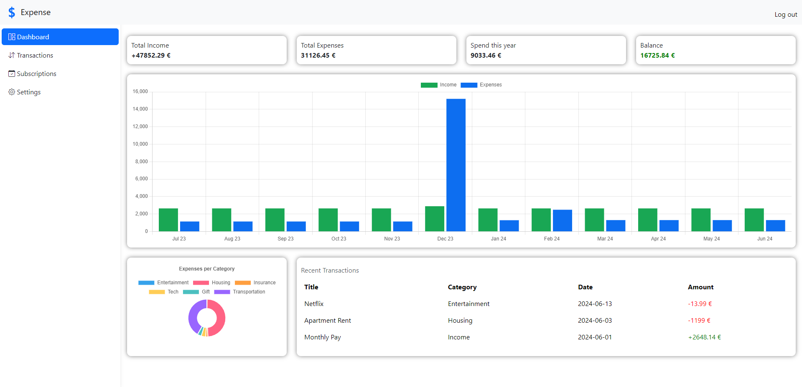
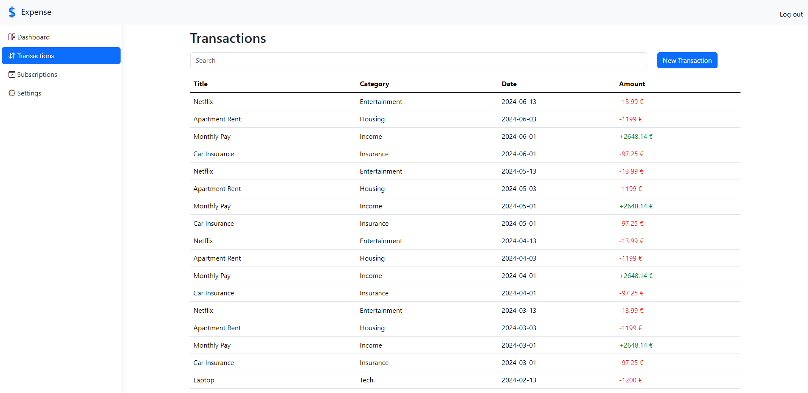
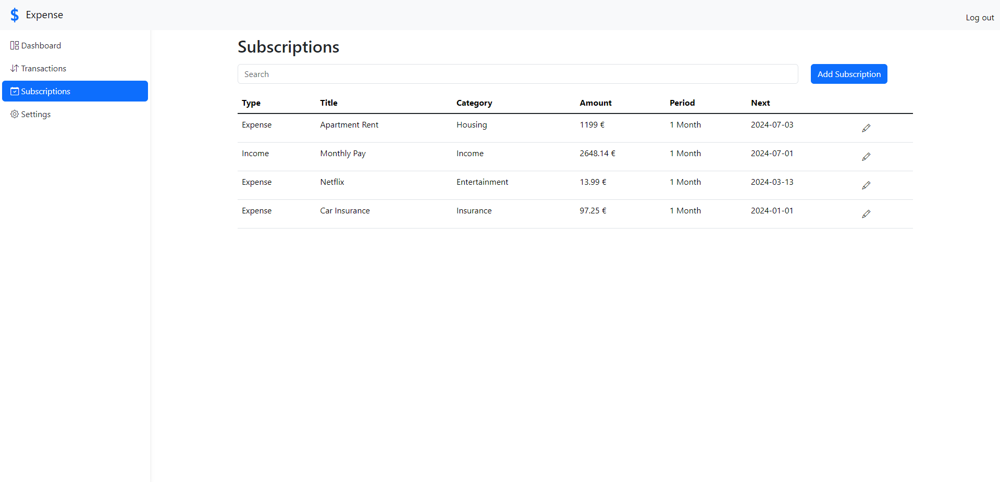
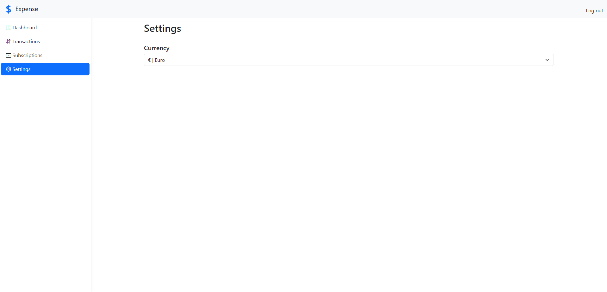

# Expense - Personal Finance Management Application
## Video Demo:  https://youtu.be/a10tbay0nM4
## Description:
Expense is a comprehensive personal finance management application designed to help you oversee and manage your financial activities effectively. It's built using Angular, Flask, Python and SQLite.

### Why I Chose This Project
I chose this project to explore Angular after a recent workshop. Additionally, it will be useful at my workplace, providing a practical application for my skills. I aimed to keep the content simple, allowing me to focus on learning Angular without the complexity of a more intricate project.

This application provides comprehensive tools for managing your finances effectively.

With the Expense Tracking feature, you can easily monitor and categorize your expenditures to gain a clear understanding of where your money is going. Organizing your expenses into predefined categories helps you identify spending patterns and make informed financial decisions.

The Income Management feature lets you record and monitor various income sources, ensuring a complete overview of your financial inflows. By logging different types of income, you can maintain a thorough understanding of your earnings.

Adding new transactions is straightforward with the Add New Transactions feature. The intuitive interface simplifies the process of recording both income and expense entries, enabling you to keep your financial records up-to-date with minimal effort.

The Subscription Management feature facilitates the management of recurring expenses and incomes. Whether dealing with monthly subscriptions or regular income, this feature helps you track all recurring financial activities, ensuring that you never miss a payment or lose sight of your regular income streams.
 
### Dashboard

The dashboard offers a comprehensive overview of your financial activities, encompassing both income and expenses and displays your current balance alongside the most recent transactions. It includes a yearly summary designed to help you monitor financial trends over time, with data visualization facilitated through interactive charts and graphs.



### Transactions

Via the transaction page, you can quickly add one-time expenses or income. Each transaction is tagged as either income or expense, and you can add a title, amount, and category to keep things organized. All your transactions are shown in a table, where you can search for transactions by any attribute.



### Subscriptions

By utilizing the subscription feature, you can efficiently manage your recurring transactions, such as monthly salary payments or subscriptions to streaming platforms. Each subscription entry includes several key details: a title, a category, an amount, as well as the start date and the frequency of the transaction. This feature provides a comprehensive and searchable overview of all your subscriptions, allowing for easy tracking and management. Additionally, you have the flexibility to update or delete your subscriptions as necessary to ensure they remain accurate and up-to-date.



### Settings 

Using the settings page you can adjust the the currency used by the side. So all your money flow can be shown in the currency you want to use.



### Currencies

- Dollar
- Euro
- Yen
- Pound

## Setup
1. Clone the repository:
```bash
git clone https://github.com/The-Qubit/expense.git
```

2. Navigate inside the project directory
```bash
cd expense
```

3. Start the application<p>
For the application to work, we need two servers. The first one is the backend server using Flask. The other one is the Angular front end.

### Starting the Frontend Server
1. Navigate inside the frontend directory
```bash
cd frontend
```

2. Install Angular
```bash
npm install -g @angular/cli
```

3. Start the server
```bash
ng serve
```

> The frontend server should now be running.

### Starting the Backend Server
1. Create and activate a virtual environment
```bash
python -m venv venv

venv\Scripts\activate // Windows
source venv/bin/activate // Linux
```

2. Install requirements
```bash
pip install -r requirements.txt
```

3. Navigate inside the backend directory
```bash
cd backend
```

4. Start the app
```bash
python app.py
```

## Usage
Open your browser and go to http://localhost:4200 to access the app.

## Contributing
You are welcome to add to this project. Just follow the following steps.

1. Create a new branch
```bash
git checkout -b <discriptive-branch-name>
```

2. Commit your changes
```bash
git add .
git commit -m "Description of your changes"
```
Please follow the conventional commit rules specified here: https://www.conventionalcommits.org/en/v1.0.0/

3. Push your changes
```bash
git push origin <your-branch-name>
```

4. Create a pull request.
- Assign the pull request to The-Qubit 
- Respond to the feedback 

5. Merge your pull request

## Future Enhancements
The application is built on a versatile framework, making it an excellent platform for adding new features. Future updates can include a variety of tools and functionalities to enhance the user experience and provide more comprehensive financial management options. Graphical representations are to be added to give users a better overview of their money flow. Enhanced graphs and analytics will enable users to visualize their financial data more effectively, helping them to identify trends, make comparisons, and gain deeper insights into their financial habits. Another anticipated feature is the addition of saving plans. This functionality will allow users to set financial goals and create customized saving plans. Users can track their progress towards these goals, making it easier to manage their savings and achieve their financial objectives.

## Design decisions
The decision to implement a REST API backend for this financial management application was driven by several strategic considerations.

Firstly, it enables easier automation of financial transactions, such as scheduled payments and recurring transactions. This automation enhances user convenience by reducing manual effort and ensuring the timely execution of financial tasks.

Secondly, opting for a REST API backend allows for greater versatility and scalability. It provides flexibility to integrate various features seamlessly and explore new functionalities in future updates. This approach ensures that the application remains adaptable to evolving user needs and technological advancements in the financial sector.

Additionally, a REST API backend supports multiple user interfaces, including web applications, mobile apps, and desktop clients. This capability ensures a consistent user experience across different platforms, allowing users to access and manage their financial data conveniently.

## License
This project is licensed under the MIT License. See the LICENSE file for more details.

## Contact
For any questions or support, please get in touch with me at kevinmaxime.r@gmail.com.
